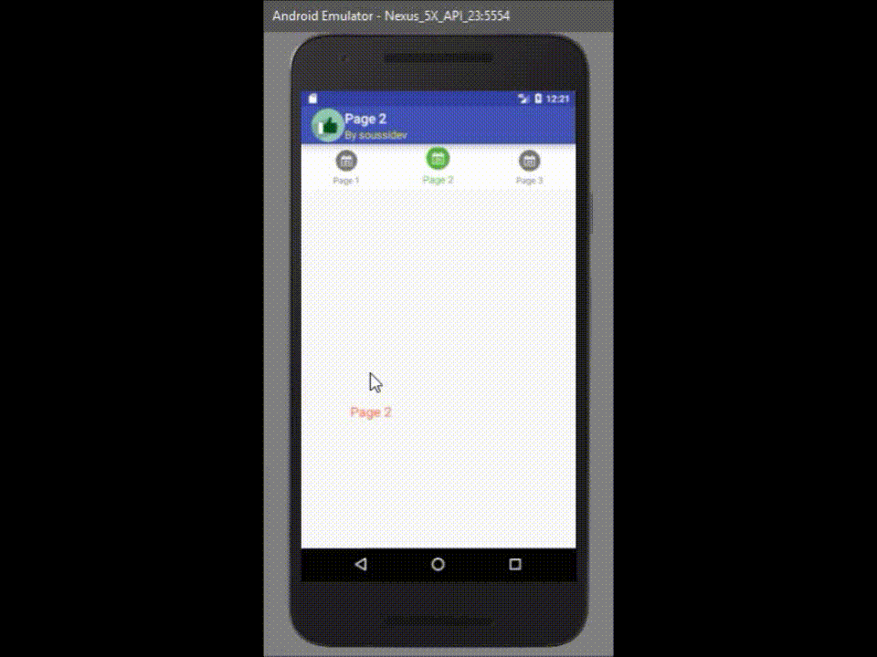

# NiceNavigation By Soussidev
Nice navigation with animation


[](https://jitpack.io/#datalink747/NiceNavigation)
<br>

# Preview :
* Nice Navigation :

<br>
&nbsp;
<br>

# Add dependencie to your project :

```gradle
dependencies {
    compile 'com.github.datalink747:NiceNavigation:1.1'
}
```

# Code in Kotlin:

* onCreate activity :

```
override fun onCreate(savedInstanceState: Bundle?) {
        super.onCreate(savedInstanceState)
        setContentView(R.layout.activity_main)

        paperflower = PaperFlower.attach2Window(this)

        navigationView = findViewById(R.id.navigationview) as NavigationView

        if (navigationView != null) {
            navigationView!!.isWithText(true)
            navigationView!!.disableShadow()
            navigationView!!.isColoredBackground(false)
            navigationView!!.setItemActiveColorWithoutColoredBackground(ContextCompat.getColor(this, R.color.menu_color_10))
        }

        val toolbar = findViewById(R.id.toolbar) as Toolbar
        setSupportActionBar(toolbar)

        viewPager = findViewById(R.id.viewpager) as ViewPager
        setupViewPager(viewPager)


        navigationView!!.setUpWithViewPager(viewPager!!, color, image, this@MainActivity)
        navigationView!!.setOnBottomNavigationItemClickListener { index ->
            getflower(toolbar)
            //   navigationView.selectTab(index);
            val name = viewPager!!.adapter.getPageTitle(index).toString()

            toolbar.title = name
            toolbar.subtitle = "By soussidev"
            toolbar.setTitleTextColor(resources.getColor(R.color.white))
            toolbar.setSubtitleTextColor(resources.getColor(R.color.menu_color_1))
            toolbar.setLogo(R.mipmap.icon_fav)
        }


    }
```
* Fun get animation from Paper Flower :

```
 fun getflower(view: View) {
        paperflower!!.paperflower(view, 450f, object : PaperFlowerListener {
            override fun onAnimationStart() {

            }

            override fun onAnimationEnd() {

            }
        })
    }
    
```

# Linkedin

<a href="https://www.linkedin.com/in/soussimohamed/">

</a>

# Licence

```
Copyright 2017 Soussidev, Inc.

Licensed under the Apache License, Version 2.0 (the "License");
you may not use this file except in compliance with the License.
You may obtain a copy of the License at

   http://www.apache.org/licenses/LICENSE-2.0

Unless required by applicable law or agreed to in writing, software
distributed under the License is distributed on an "AS IS" BASIS,
WITHOUT WARRANTIES OR CONDITIONS OF ANY KIND, either express or implied.
See the License for the specific language governing permissions and
limitations under the License.
```

